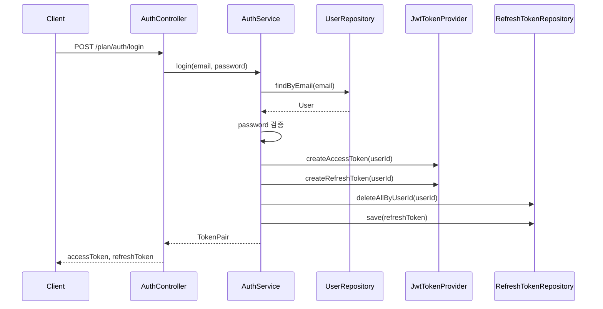
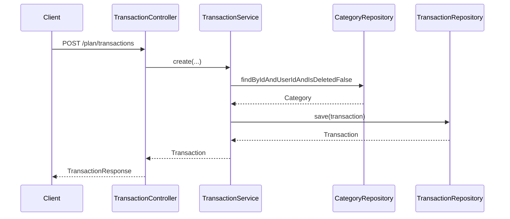

# plan-wallet

가계부 앱용 백엔드 API 서버입니다. (Kotlin + Spring Boot)

## 주요 기능
- JWT 인증/인가
- User / Category / Transaction CRUD
- 통계 API (월간 합계, 카테고리 합계)
- Swagger(OpenAPI) 문서
- Docker/Docker Compose 배포

## 실행 방법

### 로컬 실행
```bash
./gradlew bootRun
```

기본 접속:
- Swagger UI: `http://localhost:8080/swagger-ui/index.html`
- OpenAPI JSON: `http://localhost:8080/v3/api-docs`

### Docker Compose 실행
```bash
docker-compose up --build
```

## 환경 변수
- `SPRING_DATASOURCE_URL`
- `SPRING_DATASOURCE_USERNAME`
- `SPRING_DATASOURCE_PASSWORD`
- `JWT_SECRET`

## API 요약
- `POST /plan/auth/login`
- `POST /plan/auth/refresh`
- `POST /plan/users`
- `GET /plan/users/me`
- `POST /plan/categories`
- `GET /plan/categories`
- `PATCH /plan/categories/{id}`
- `DELETE /plan/categories/{id}`
- `POST /plan/transactions`
- `GET /plan/transactions`
- `PATCH /plan/transactions/{id}`
- `DELETE /plan/transactions/{id}`
- `GET /plan/stats/monthly`
- `GET /plan/stats/categories`
- `GET /plan/stats/monthly/compare`

## 패키지 구조
```
src/main/kotlin/com/planwallet
├─ application
│  ├─ auth
│  ├─ category
│  ├─ stats
│  ├─ transaction
│  └─ user
├─ domain
│  ├─ auth
│  ├─ category
│  ├─ transaction
│  └─ user
├─ infrastructure
│  ├─ auth
│  ├─ category
│  ├─ transaction
│  └─ user
├─ presentation
│  ├─ auth
│  ├─ category
│  ├─ stats
│  ├─ transaction
│  └─ user
└─ global
   ├─ config
   ├─ error
   └─ security
```

## 시퀀스 다이어그램

### 로그인 + 토큰 발급


### 거래 생성


## 테스트
```bash
./gradlew test
```

END
